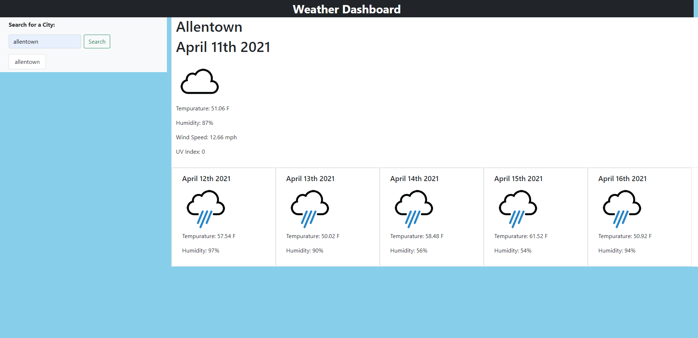

# Weather_Report
## Acceptance Criteria
```
1. When you search for a city, you are presented with current and future conditions for that city and that city is added to the seach history
2. When you view the current weather conditions for that city, then you are presented with the city name, date, and icon representation of the wweather conditions, the tempeerature, the humidity, the wind speed, and the UV index
3.You are presented with a color that indicates whether the conditions are favorable, moderate, or severe
4.When you view the future weather conditions for that city, then you are presented with a 5-day forecast that displays the date, an icon representation of weather conditions, the themperature, and the humidity
5.When you click on a city in the search history, you are then presented with current and future conditions for that city.
```
## Mock-up
The following image shows the web application's appearance and functionality:
